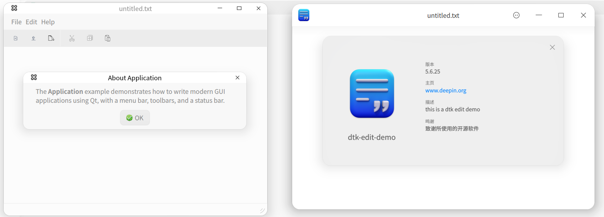

# dtk-edit-demo
qt to dtk demo

改造 Qt demo 为 Dtk 风格



主要改动的地方
#### 工程改造，导入 dtk

```
QT += dtkcore dtkgui dtkwidget
```

#### 引用 dtk 相关头文件

```cpp
// include dtk headers
#include <DApplication>
#include <DMainWindow>
...
```

#### 使用 dtk 相关类替换 Qt 原生类

```cpp
QApplication ==> DApplication
QMainWindow ==> DMainWindow
```
#### 使用 dtk 相关命名空间
```cpp
// use dtk namespace
DCORE_USE_NAMESPACE
DGUI_USE_NAMESPACE
DWIDGET_USE_NAMESPACE

```

#### 更多
- 设置对话框 DSettingsDialog
- 关于对话框 DAboutDialog
- MessageBox 调整 DDialog
- 加载默认翻译（Qt / dtkwidget）
- 开启日志记录 LogManager
- dtk 风格主窗口，标题栏，主菜单
- 应用内部通知（sendMessage）
- 移除了 menubar
- 移除了 toolbar
- 移除了 statusbar


